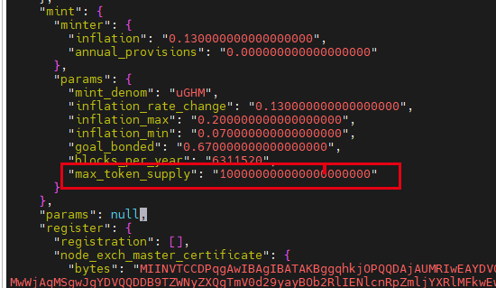

## 引导节点搭建

### 1.1 开放端口

一般来说， 放开 p2p，tendermint 即可。

```bash
# 开启相关端口
ufw allow 26656  # 开放p2p端口
ufw allow 26657  # 开放tendermint端口（可选）
ufw allow 9091   # grpcweb（可选）
ufw allow 9090   # grpc（可选）
ufw allow 1317   # api（可选）
```

### 1.2 enclave 初始化

```bash
# 创建存放sgx远程证明证书的目录
# 这个证书有因特尔签名的报告
mkdir -p /opt/ghm/.sgx_ghms

# 创建环境变量
# /usr/lib 下存放了三个重要的.so 动态库，与sgx相关
export GHM_ENCLAVE_DIR=/usr/lib
export GHM_SGX_STORAGE=/opt/ghm/.sgx_ghms

# 初始化enclava环境
# 这个命令会生成一个英特尔签名的远程证明证书
ghmd init-enclave

# 检查是否有生成证书
ls -h /opt/ghm/.sgx_ghms/attestation_cert.der
```

### 1.3 设置链参数

```bash
# 设置链的id
ghmd config chain-id ghmdev
# 设置key模式
ghmd config keyring-backend test
# 初始化链 banana 是节点别名，可以换
ghmd init banana --chain-id ghmdev

# 修改 app 中 gas 代币的名字
# 修改 创世文件中的代币名字
# stake -> uGHM
perl -i -pe 's/"stake"/ "uGHM"/g' ~/.ghmd/config/genesis.json

# 修改mint 模块下的最大代币供应量数值
# 请手动修改, 如下面图：
```



### 1.4 设置初始账号金额

```bash
# 添加一个账号,助记词会打印在屏幕
# 备份助记词相关助记词
ghmd keys add a
ghmd keys add b
ghmd keys add c

# 配置账号的初始金额
# 将 a 账号的信息写入创世块配置
ghmd  add-genesis-account "$(ghmd keys show -a a)"  1000000000000000000uGHM
ghmd  add-genesis-account "$(ghmd keys show -a b)"  1000000000000000000uGHM
ghmd  add-genesis-account "$(ghmd keys show -a c)"  1000000000000000000uGHM
```

### 1.5 创建链的第一个验证器

```bash
# 生成一笔交易： 账号 a 委托的第一个验证器  1 GHM  = 1000000 uGHM  最少自我委托是 1GHM
# 注意要加上gas-prices
ghmd gentx a 1000000uGHM --chain-id ghmdev --gas-prices 0.25uGHM

# 将这比交易收集进入genesis.json 中
ghmd collect-gentxs

# 验证是genesis.json 是否有效
ghmd validate-genesis
```

### 1.6 运行初始节点

```bash
# 初始化引导节点
ghmd init-bootstrap
ghmd validate-genesis

# orlogs
# 创建一个logs文件夹, 方便看日志而已
mkdir logs
nohup ghmd start --rpc.laddr tcp://0.0.0.0:26657 --bootstrap >./logs/nohup.out 2>&1 & 

# 运行之后，查看 
ghmd status
```
