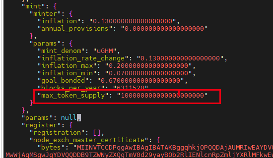

# 节点搭建

## 一 bootstrap 引导节点搭建

### 1.1 开放端口

一般来说， 放开 p2p，tendermint 即可。

```bash
# 开启相关端口
ufw allow 26656  # 开放p2p端口
ufw allow 26657  # 开放tendermint端口（可选）
ufw allow 9091   # grpcweb（可选）
ufw allow 9090   # grpc（可选）
ufw allow 1317   # api（可选）
```

### 1.2 enclave 初始化

```bash
# 创建存放sgx远程证明证书的目录
# 这个证书有因特尔签名的报告
mkdir -p /opt/ghm/.sgx_ghms

# 创建环境变量
# /usr/lib 下存放了三个重要的.so 动态库，与sgx相关
export GHM_ENCLAVE_DIR=/usr/lib
export GHM_SGX_STORAGE=/opt/ghm/.sgx_ghms

# 初始化enclava环境
# 这个命令会生成一个英特尔签名的远程证明证书
ghmd init-enclave

# 检查是否有生成证书
ls -h /opt/ghm/.sgx_ghms/attestation_cert.der
```

### 1.3 设置链参数

```bash
# 设置链的id
ghmd config chain-id ghmdev
# 设置key模式
ghmd config keyring-backend test
# 初始化链 banana 是节点别名，可以换
ghmd init banana --chain-id ghmdev

# 修改 app 中 gas 代币的名字
# 修改 创世文件中的代币名字
# stake -> uGHM
perl -i -pe 's/"stake"/ "uGHM"/g' ~/.ghmd/config/genesis.json

# 修改mint 模块下的最大代币供应量数值
# 请手动修改, 如下面图：
```



### 1.4 设置初始账号金额

```bash
# 添加一个账号,助记词会打印在屏幕
# 备份助记词相关助记词
ghmd keys add a
ghmd keys add b
ghmd keys add c

# 配置账号的初始金额
# 将 a 账号的信息写入创世块配置
ghmd  add-genesis-account "$(ghmd keys show -a a)"  1000000000000000000uGHM
ghmd  add-genesis-account "$(ghmd keys show -a b)"  1000000000000000000uGHM
ghmd  add-genesis-account "$(ghmd keys show -a c)"  1000000000000000000uGHM
```

### 1.5 创建链的第一个验证器

```bash
# 生成一笔交易： 账号 a 委托的第一个验证器  1 GHM  = 1000000 uGHM  最少自我委托是 1GHM
# 注意要加上gas-prices
ghmd gentx a 1000000uGHM --chain-id ghmdev --gas-prices 0.25uGHM

# 将这比交易收集进入genesis.json 中
ghmd collect-gentxs

# 验证是genesis.json 是否有效
ghmd validate-genesis
```

### 1.6 运行初始节点

```bash
# 初始化引导节点
ghmd init-bootstrap
ghmd validate-genesis

# 后台运行
nohup ghmd start --rpc.laddr tcp://0.0.0.0:26657 --bootstrap

# orlogs
# 创建一个logs文件夹, 方便看日子而已
mkdir logs
nohup ghmd start --rpc.laddr tcp://0.0.0.0:26657 --bootstrap >./logs/nohup.out 2>&1 & 

# 或者直接运行
ghmd start --rpc.laddr tcp://0.0.0.0:26657 --bootstrap

# 运行之后，查看 
ghmd status

# 节点p2p种子
ghmd tendermint show-node-id
```


## 二 node 一般节点搭建

加入已有的网络

### 2.1 开放端口
```bash
#ufw 开放防火墙
ufw allow 26656 #p2p
```
### 2.1 下载安装deb包

```bash 
# 获取已经打包好的deb
# 目前是 0.0.3-dev 版本，后期更新请更换最新的
wget https://github.com/HermitMatrixNetwork/HermitMatrixNetwork/releases/download/v0.0.3/hermitmatrixnetwork_0.0.3-dev_amd64.deb

# 安装
dpkg -i hermitmatrixnetwork_0.0.3-dev_amd64.deb
```

### 2.3 初始化enclave

```bash
# 创建存放sgx远程证明证书的目录
# 这个证书有因特尔签名的报告
mkdir -p /opt/ghm/.sgx_ghms

# 创建环境变量
# /usr/lib 下存放了三个重要的.so 动态库，与sgx相关
export GHM_ENCLAVE_DIR=/usr/lib
export GHM_SGX_STORAGE=/opt/ghm/.sgx_ghms

# 初始化enclava环境
# 这个命令会生成一个英特尔签名的远程证明证书
ghmd init-enclave

# 检查是否有生成证书
ls -h /opt/ghm/.sgx_ghms/attestation_cert.der

# 提取公钥
PUBLIC_KEY=$(ghmd parse /opt/ghm/.sgx_ghms/attestation_cert.der 2> /dev/null | cut -c 3- )
```

### 2.4  注册节点

```bash
# 指向引导节点 or 可信的全节点
ghmd config node tcp://45.32.116.172:26657

# 初始化节点别名,  hostname 自己取
ghmd init $hostname --chain-id ghmdev


# 引导节点的p2p种子 or 可信全节点的p2p
# 查看 bootstrap 
PERSISTENT_PEERS="bdc731280afb3c1fa8e6396eda4be59b333b3fc5@45.32.116.172:26656"

# 将种子写入文件
sed -i 's/persistent_peers = ""/persistent_peers = "'$PERSISTENT_PEERS'"/g' ~/.ghmd/config/config.toml

# 打印种子
echo "Set persistent_peers: $PERSISTENT_PEERS"

# 创建一个账号，用户管理这个节点, dafni 是key的名称
ghmd config keyring-backend test
ghmd keys add dafni

# 使用代币的账户给 dafni 转账
ghmd tx bank send ghm1jvtdv8674llygwn8s0d7z47uctyjf9uxu9p8k4
ghm17tuk77p0eqs8nqevwhqs9lrsqm54e56uef6rey 1050000upsc --gas-prices 0.0125uGHM

# 注册节点
ghmd tx register auth /opt/ghm/.sgx_ghms/attestation_cert.der -y --from <your account> --gas-prices 0.25uGHM

# 注册成功则可以拿到共享种子
SEED=$(ghmd q register seed "$PUBLIC_KEY" 2> /dev/null | cut -c 3-)

# 打印种子信息，看是否为空
echo "SEED: $SEED"

# 设置网络证书，这个命令会生产两个证书
ghmd q register secret-network-params 2> /dev/null

ghmd configure-secret node-master-cert.der "$SEED"

# 下载创世文件，替换 (.ghm/config/genesis.json)
# 使用引导节点的genesis.json
xxxxx

# 校验创世文建是否有效
ghmd  validate-genesis
```

### 2.5 运行节点

```bash
# 完成注册，将配置指向自己
ghmd config node tcp://localhost:26657

# 运行节点
nohup ghmd start >./logs/nohup.out 2>&1 & 
```


## 三 node 成为验证人

```bash
# 注意 1 GHM = 1000000uGHM
  ghmd tx staking create-validator \
  --amount=1000000uGHM \
  --pubkey=$(ghmd tendermint show-validator) \
  --identity=caca-boxi \
  --details="To infinity and beyond!" \
  --commission-rate="0.10" \
  --commission-max-rate="0.20" \
  --commission-max-change-rate="0.01" \
  --min-self-delegation="1" \
  --moniker=caca \
  --from=caca \
  --chain-id=ghmdev \
  --gas-prices 0.25uGHM
```

