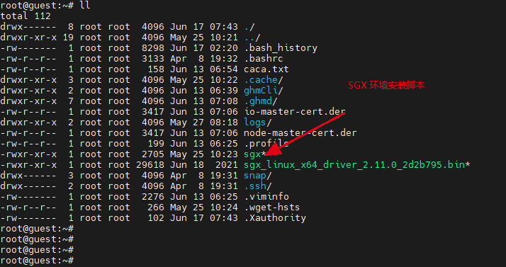
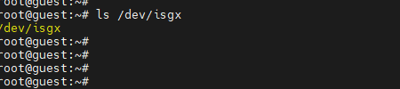
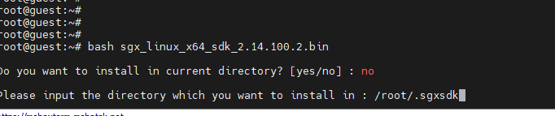

## 链运行环境搭建

### 一 硬件检查

step 1: 

- cpu 型号支持 sgx

step 2: 

- BIOS 设置 
  -  关闭 hyperthreading,   
  -   关闭 Turboboost

​     开机进入BIOS 设置模式，进入cpu 设置的模式找到相关配置关闭相关功能。


### 二 软件安装

- OS  ubuntu20.04

#### 2.1 安装SGX 环境

1. 可以使用提供好的脚本 本目录下的sgx 文件就是

```
# 下载官方提供好的脚本
wget https://raw.githubusercontent.com/SecretFoundation/docs/main/docs/node-guides/sgx
# 赋予执行权限
chmod +x sgx
# 执行安装脚本
bash sgx
```

脚本：



2. 检查是否安装成功

```bash
ls /dev/isgx
```

安装成功会挂载 isgx 设备。



3. 安装 sgx sdk

​       脚本已经安装了sgx 开发相关组件，我们还需要再安装 sgx sdk，编译需要依赖相关文件。

```bash
# 下载 sgx sdk 
wget https://download.01.org/intel-sgx/sgx-linux/2.14/distro/ubuntu20.04-server/sgx_linux_x64_sdk_2.14.100.2.bin

# +x 添加执行权限 
chmod +x sgx_linux_x64_sdk_2.14.100.2.bin

# 创建安装目录
mkdir .sgxsdk

# 运行安装
bash sgx_linux_x64_sdk_2.14.100.2.bin

# 提示安装目录 一般我们安装再 /root/.sgxsdk 下面
# 输入  .sgxsdk (假设你是再root下)
```



#### 2.2 安装 rust 环境

```bash
# 运行安装脚本脚本， 如果提示输入 直接enter默认
curl --proto '=https' --tlsv1.2 -sSf https://sh.rustup.rs | sh


# 安装完成后还需要添加一些支持工具
rustup component add rust-src clippy
rustup target add wasm32-unknown-unknown
cargo +stable install xargo
```

#### 2.3 安装 go 环境

go 版本 1.17 以上  (请查看网上教程，此处略。 重点需要安装 go-bindata 工具)

```bash
# 安装go 之后 将 go-bindata 安装上
# 这个工具是将 spid.txt api_key.txt 绑定到go程序
apt install go-bindata
```

#### 2.4 安装相关工具软件

```bash
wget https://github.com/mozilla/sccache/releases/download/0.2.13/sccache-0.2.13-x86_64-unknown-linux-musl.tar.gz

tar xf ./sccache-*.tar.gz

mv ./sccache*/sccache "$HOME/sccache"
```

### 三 下载deb包

```bash
# 获取已经打包好的deb
# 目前是 0.0.3-dev 版本，后期更新请更换最新的
wget https://github.com/HermitMatrixNetwork/HermitMatrixNetwork/releases/download/v0.0.6/hermitmatrixnetwork_0.0.6_amd64.deb

# 安装
dpkg -i hermitmatrixnetwork_0.0.3-dev_amd64.deb

# 检查, 看到输出安装成功
ghmd -h
```


### 四 编译项目(可选)

- 已经安装了deb 包的不需要自己手动编译。

拉取项目

```bash
git clone https://github.com/HermitMatrixNetwork/HermitMatrixNetwork.git
```

进入项目目录

```bash
cd HermitMatrixNetwork
```

添加 spid, api_key

```bash
mkdir -p ias_keys/develop

# 将相应的spid.txt   api_key.txt  放入相关目录下面
```

编译

```bash
source "$HOME/.sgxsdk/sgxsdk/environment"
make vendor
SGX_MODE=HW BUILD_PROFILE="release" RUSTC_WRAPPER="$HOME/sccache" make build-linux
```

编译成功，生产ghmcli, ghmd ， 然后我们可以制作一个deb 包

```bash
VERSION=0.0.1 make deb-no-compile
```
成功打包之后，输出在当前目录。

使用 dpkg 安装
```bash
dpkg -i xxxxxxx.deb
```

如果需要卸载，使用 -r 指定包名
```bash
dpkg -r hermitmatrixnetwork
```
